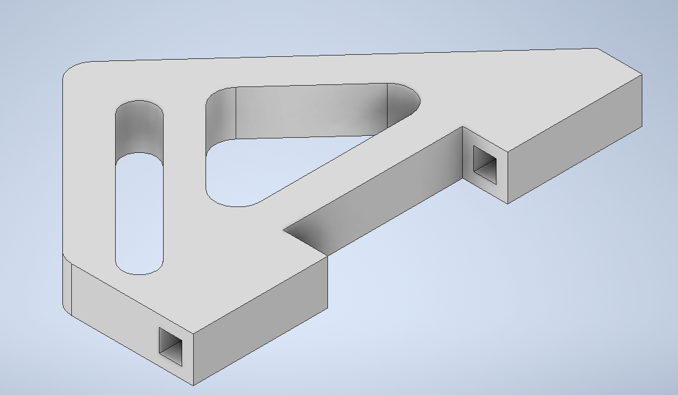

# MiniBot2021 Frantic Fetch

## Intake Design

During discussions after the Frantic Fetch reveal, our team decided to design intakes for both the front and back of the robot.  This would allow us to capture the first and third golf balls while driving forward and the second golf ball while driving backwards.  Using both forward and backwards motion would eliminate the need to turn the robot after capturing each golf ball.

We decided to use a passive (non-motorized) intake, which would be much lighter and have a lower profile than adding a motorized intake.  The light weight design would also be off the ground, so we wouldn’t incur any penalties if it extended across a black line.

The intake design sits on shafts that are mounted under the robot body and secured with zip ties.  Two intake pieces are mounted on either side of the robot, parallel from each other.  A light metal bar sits in the diagonal opening across the two intake pieces on either side of the robot.  The bar moves up when contacting a golf ball, which allows the ball to enter the holding area.  Once the ball is inside the holding area, gravity pulls the bar back down to prevent the golf ball from escaping.

The intake can be adjusted on the shafts to allow for more space on the front side of the robot (when running our Ramsette Autonomous program which only moves forward) or spaced evenly on both sides (when running our Teleop or Directional Autonomous program which capture balls on both sides of the robot)

The intake was designed in a CAD program and then printed on a 3D printer.

## Autonomous Control

We took two approaches to the autonomous portion of the Frantic Fetch Challenge:

### Directional Autonomous

Because of the number of obstacles on this course, we felt that using separate forwards, backwards and turning commands would give us the precision needed to complete the course without incurring penalties.  The forward and backwards movement would allow us to use intakes on both sides of the robot and eliminate the need to turn 180 degrees after capturing each golf ball.

### Ramsete Autonomous

The Ramsete autonomous program that we used in previous challenges has a much smoother trajectory than our Directional Autonomous program.  But because the program requires the robot to move forward for the entire trajectory, the robot would need to turn 180 degrees after capturing each golf ball.  This lengthened the course for the robot and increased the risk of contact with obstacles.  The intake was moved forward on the robot to allow room to capture all 3 golf balls in front.

## Teleop Control

We continued to work with a GameCube controller that was implemented during the Color Conundrum Challenge and added a reverse acceleration button to allow our driver to move the robot both forwards and backwards.  The plan was to drive forward to capture the first ball, then backwards to capture the second ball.  The driver would then move forwards to capture the third ball and finally backwards to complete the run.  Capturing golf balls on both the front and back of the robot allows the driver to take the most efficient course to complete the challenge.
